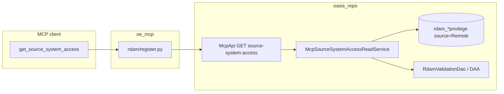

# NFD-48785 — Implementation Plan

**Jira:** [NFD-48785](https://ovaledge.atlassian.net/browse/NFD-48785)  
**Branch:** `story/NFD-48785-mcp-dam` (oe_mcp, oasis_repo)  
**Technical reference:** [NFD-48785-data-access-mcp-context.md](./NFD-48785-data-access-mcp-context.md)

---

## 1. Ticket summary (from Jira description)

### Problem

`get_user_object_access` resolves effective access at the **OvalEdge catalog permission** layer. There is no equivalent tool for access that exists **natively** in source systems — Redshift, Snowflake, and Tableau — independent of OvalEdge grants.

Twitch and other customers need to answer questions such as:

- “What tables can this service account actually query in Redshift?”
- “Which users have native access to this table?”

…without logging into each source system manually.

### Solution

A single MCP tool **`get_source_system_access`** that queries OvalEdge’s **harvested source-system metadata** in two directions:

| Direction | Parameter | Question answered |
|-----------|-----------|-------------------|
| Forward | `user_to_objects` + `username` | What can this principal access? |
| Reverse | `object_to_users` + `object_path` | Who can access this object? |

Supported platforms: **Redshift**, **Snowflake**, **Tableau**. Each platform has a different grant model; the tool returns a **normalised** response with `grant_mechanism` so the bot can explain lineage.

### Access grant models (by source)

| Source | Mechanisms | Notes |
|--------|------------|--------|
| **Redshift** | `direct`, `group`, `role` | All three evaluated and returned |
| **Snowflake** | `role` only | No direct user grants, no groups |
| **Tableau** | `direct` | User or service account on project/report |

### How this differs from `get_user_object_access`

| | `get_user_object_access` | `get_source_system_access` |
|--|--------------------------|----------------------------|
| Access layer | OvalEdge catalog permissions | Native source grants |
| Grant mechanisms | OE user grants + OE roles | RS: direct/group/role; SF: role; Tableau: direct |
| Permission model | metadata-read/write + data levels | Native privileges (SELECT, INSERT, ALL, …) |
| Object scope | All 17 OE asset types | RS/SF: database, schema, table, column (RS column opt-in); Tableau: project, report |

---

## 2. Pull requests (NFD-48785 only)

| Repo | PR | Title / merge | Scope |
|------|-----|---------------|--------|
| **oe_mcp** | [#14](https://github.com/ovaledge/oe_mcp/pull/14) | NFD-48785 MCP DAM changes | Initial MCP tool, constants, unit tests, context doc |
| **oe_mcp** | [#16](https://github.com/ovaledge/oe_mcp/pull/16) | Story/nfd 48785 mcp dam | Live integration tests, integration harness, doc updates |
| **oasis_repo** | [#67190](https://bitbucket.org/ovaledge/oasis_repo/pull-requests/67190) | story/NFD-48785-mcp-dam | `GET /v1/mcp/source-system-access`, `McpSourceSystemAccessReadService`, DTOs, DAA checks, Postman entry |

Subsequent commits on `story/NFD-48785-mcp-dam` (oe_mcp + oasis_repo) extend the same ticket — e.g. database-level `rdam_dbprivilege`, partial-path disambiguation, `principalNote` for roles/groups without harvested members — without separate Jira keys.

---

## 3. Architecture



| Layer | Artifact |
|-------|----------|
| MCP | `server/tools/rdam/register.py` → `get_source_system_access` |
| HTTP | `GET /api/v1/mcp/source-system-access` |
| Service | `McpSourceSystemAccessReadService.java` |
| Data | `rdam_dbprivilege`, `rdam_tableprivilege`, `rdam_schemaprivilege`, `rdam_columnprivilege` (RS/SF); `rdam_folderprivilege` / report privileges (Tableau) |
| AuthZ | Instance / Connector **Data Access Admin** enforced in read service |

MCP layer: parameter validation + proxy only. All grant resolution and DAA enforcement live in **oasis_repo**.

---

## 4. Acceptance criteria traceability

| # | Criterion | Status | Where verified |
|---|-----------|--------|----------------|
| AC1 | Tool accepts `source_system`, `query_direction`, and `username` or `object_path` | Done | MCP tool + REST query params; `tests/tools/test_data_access_management.py` |
| AC2 | Redshift: direct, group, role — all returned with mechanism | Done | Backend `queryDirectPrivileges`, `queryGroupExpandedPrivileges`, `queryRoleExpandedPrivileges`; live RS tests |
| AC3 | Snowflake: role only; contributing roles in response | Done | Backend role expansion; unit + live SF tests |
| AC4 | Tableau: direct grants on project/report | Done | `queryTableauPrivileges`; live Tableau tests (when path configured) |
| AC5 | `grant_mechanism`: direct \| group \| role | Done | `McpSourceSystemAccessGrant.grantMechanism` |
| AC6 | `user_to_objects`: all accessible objects, privileges, mechanism | Done | `resolveUserToObjects` + `summary.byObjectLevel` |
| AC7 | `object_to_users`: users, mechanism, contributing group/role | Done | `resolveObjectToUsers`; optional `principalNote` when role/group has no harvested members |
| AC8 | Object levels: RS db/schema/table/column (column opt-in); SF db/schema/table; Tableau project/report | Done | `include_columns` (RS); `rdam_dbprivilege` for database level |
| AC9 | Native grants only (not OE catalog ACL) | Done | Filter `source = 'Remote'` in read service |
| AC10 | Unsupported `source_system` → validation error | Done | MCP pre-check + API 400 |
| AC11 | Unknown user/object → not-found with clear field | Done | API 400; integration tests |
| AC12 | Read-only | Done | GET only; no write endpoints |

### Sample prompts (from ticket)

| Prompt | Call |
|--------|------|
| What Redshift tables can svc_analytics access, and how granted? | `source_system=redshift`, `query_direction=user_to_objects`, `username=svc_analytics` |
| Who has access to prod_db.public.orders? | `source_system=redshift`, `query_direction=object_to_users`, `object_path=prod_db.public.orders` |
| What can john.doe query in Snowflake; which roles? | `source_system=snowflake`, `query_direction=user_to_objects`, `username=john.doe` |
| Who can access Revenue Dashboard in Tableau? | `source_system=tableau`, `query_direction=object_to_users`, `object_path=Executive/Revenue Dashboard` |
| Does svc_etl have write on transactions table? | `user_to_objects` + filter grants by `object_path` and privileges INSERT/UPDATE |

Workflow prompt: `native_source_access` in `server/prompts/workflows/register.py`.

---

## 5. Implementation phases

### Phase 1 — Backend API (oasis_repo, PR #67190)

- [x] DTOs: `McpSourceSystemAccessGrant`, `McpSourceSystemAccessPayload`, `McpSourceSystemAccessSummary`
- [x] `McpSourceSystemAccessReadService` — bidirectional resolution over RDAM harvest
- [x] `McpApi` + `McpApiService` — `GET /v1/mcp/source-system-access`
- [x] Instance / Connector DAA via `McpDamReadService` / `RdamValidationDao`
- [x] Postman: “GET Source system access” in `McpApi.postman_collection.json`

### Phase 2 — MCP tool (oe_mcp, PR #14)

- [x] Register `get_source_system_access` in `server/tools/rdam/register.py`
- [x] Client validation for required params per direction
- [x] Tool description: grant models, object_path formats, DAA scope
- [x] Unit tests (mocked HTTP client)
- [x] Context doc for operators and agents

### Phase 3 — Integration & hardening (oe_mcp PR #16 + branch follow-ups)

- [x] Live integration suite: `tests/integration/test_source_system_access_live.py`
- [x] Partial-path disambiguation (`ambiguousMatch`, `matchCandidates`, `resolveAllMatches`)
- [x] Database-level grants (`rdam_dbprivilege`) for Redshift/Snowflake
- [x] `principalNote` when role/group has no harvested user members
- [ ] CI integration tests against seeded `oe-rdam` SQL (no live OvalEdge dependency)

### Phase 4 — Deploy & enablement

- [ ] Merge/deploy oasis_repo branch to target OvalEdge environment
- [ ] Publish oe_mcp; restart MCP clients (Cursor, Copilot, etc.)
- [ ] Validate sample prompts with customer-like data (Twitch RS/SF scenarios)

---

## 6. Why `get_user_object_access` is out of scope

> **Naming trap:** In Jira and backend comments, **`get_user_object_access`** means a *future* MCP tool for **OvalEdge catalog ACLs**. In oe_mcp today, the shipped native-grant tool is also exposed as **`user_object_access`** (same API as `get_source_system_access`). Those are **not** the catalog tool — do not confuse the MCP tool name `user_object_access` with the Jira concept `get_user_object_access`.

### Two different “who can access what?” questions

| Question the user asks | Correct layer | Tool (now or planned) |
|------------------------|---------------|------------------------|
| “Can **Alice** edit this **table asset** in OvalEdge?” / “Who has **metadata-read** on this catalog object?” | **OvalEdge catalog** permissions (in-app ACL, governance roles, access cart, project scope) | **`get_user_object_access`** — *not built in NFD-48785* |
| “Can **svc_analytics** run **SELECT** on `prod_db.public.orders` **in Redshift**?” / “Which **Snowflake roles** give john.doe access?” | **Native** grants in the source DB/BI platform (harvested RDAM) | **`get_source_system_access`** / `user_object_access` — **this ticket** |

NFD-48785 exists because the first tool does **not** answer the second class of questions, and vice versa.

### What `get_user_object_access` would do (not delivered here)

When it ships, it would resolve **effective access inside OvalEdge** for catalog objects (`oetable`, `oecolumn`, `oechart`, files, APIs, etc.):

- Permissions such as **metadata-read**, **metadata-write**, **data-read**, steward/custodian governance, access-cart / service-desk flows.
- Data rooted in OvalEdge security (e.g. Spring ACL / catalog access management), **not** `rdam_*privilege` with `source = 'Remote'`.
- Scope: broadly **17+ catalog asset types**, not Redshift/Snowflake/Tableau path syntax.

Typical customer wording: “Who can see this dataset **in the catalog**?” or “Does this user have **Meta Write** on the asset?”

### What NFD-48785 delivers instead

**`get_source_system_access`** reads **harvested native privilege** metadata only:

| Aspect | NFD-48785 (`get_source_system_access`) |
|--------|----------------------------------------|
| Data store | `rdam_dbprivilege`, `rdam_tableprivilege`, `rdam_schemaprivilege`, `rdam_columnprivilege`, Tableau folder/report privileges |
| Filter | `source = 'Remote'` (native harvest only) |
| Principals | Remote logins, service accounts, RS groups/roles, SF roles |
| Privileges | `SELECT`, `INSERT`, `USAGE`, `ALL`, … — not OE metadata/data permission enums |
| Platforms | `redshift`, `snowflake`, `tableau` only |
| AuthZ for query | Instance / Connector **Data Access Admin** (RDAM), not generic catalog read |

Typical customer wording (Twitch): “What can this **service account actually query in Redshift**?” — that requires native grants, not catalog ACL.

### Why they must stay separate (not one combined tool)

1. **Different truth sources** — Catalog ACL can allow metadata visibility while the user has **no** `SELECT` in Redshift; native `SELECT` does not imply OvalEdge **metadata-write**. Merging would return misleading “access” for compliance and ops bots.

2. **Different resolution logic** — Catalog: OE user ↔ OE roles ↔ object ACL. Native: direct / group / role expansion over RDAM harvest (RS three mechanisms, SF role-only, Tableau direct).

3. **Different object identity** — Catalog uses `objectType` + OvalEdge ids (`oetable` 12345). Native uses `database.schema.table`, `connectionName.dbName`, or Tableau `Project/Report` paths.

4. **Different ticket lifecycle** — NFD-48785 acceptance criteria are entirely native-grant oriented. Catalog ACL MCP is a **follow-on** capability; implementing it inside this ticket would duplicate DAM UI semantics and blow scope.

5. **Agent routing** — MCP instructions and `native_source_access` prompt must call **only** native tools for “who can query in Snowflake?” so the model does not answer from catalog permissions by mistake.

Backend explicitly documents the split: `McpApi` javadoc on `source-system-access` states it is **not** OvalEdge catalog ACLs and points to `get_user_object_access` when available.

### What was *not* built under NFD-48785

- No REST route or MCP tool that answers catalog ACL / `get_user_object_access` behavior.
- No reads of OvalEdge `acl_entry_*` (or equivalent) for “who can open this asset in the app.”
- No mapping from catalog object id → “effective OE permission level” for the MCP caller.
- No conflation of OvalEdge **governance roles** (steward/custodian) with Redshift **roles** (`role_read_only`).

### Other out-of-scope items (same ticket boundary)

- Write / grant mutation in source systems (read-only GET).
- Tableau group/role models (not in current RDAM harvest for this API).
- Unsupported `source_system` values (e.g. postgres) — validation error, not extension in this story.

---

## 7. Remaining follow-ups (NFD-48785)

| Item | Notes |
|------|--------|
| Tableau report-level join via `oechart` / `chart` | Richer report resolution when harvest is incomplete |
| Seeded RDAM integration tests | Deterministic CI without live JWT |
| Deploy branch deltas | Ensure environments run latest `story/NFD-48785-mcp-dam` backend, not only merged #67190 baseline |

---

## 8. Test plan

```bash
# Unit (oe_mcp, no OvalEdge)
cd oe_mcp
poetry run pytest tests/tools/test_data_access_management.py -q

# Live integration (requires OvalEdge + NFD-48785 backend)
export OE_INTEGRATION_JWT='...'
poetry run pytest -c tests/integration/pytest.ini tests/integration -m integration

# Manual API
curl -G "$OVALEDGE_BASE_URL/api/v1/mcp/source-system-access" \
  --data-urlencode "sourceSystem=redshift" \
  --data-urlencode "queryDirection=user_to_objects" \
  --data-urlencode "username=svc_analytics" \
  -H "Authorization: jwt <token>"
```

---

## 9. Definition of done

NFD-48785 is **done** when:

1. All acceptance criteria in §4 are met in a deployed environment with harvested RDAM data.
2. MCP clients expose `get_source_system_access` with documentation matching ticket grant models.
3. Sample prompts in §4 return correct mechanisms (direct/group/role vs role-only vs Tableau direct).
4. Callers without Instance/Connector DAA receive the RDAM no-access error (not empty success).
5. PRs #14, #16 (oe_mcp) and backend equivalent on `story/NFD-48785-mcp-dam` are merged to the release branch used by the customer environment.
