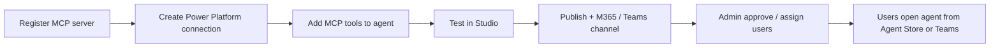

# Microsoft Copilot + OvalEdge MCP

This guide is for **Microsoft Copilot Studio** and **Microsoft 365 Copilot** / **Teams** (via a published Studio agent). It is **not** for **GitHub Copilot** in VS Code — see [SETUP_VSCODE_GITHUB_COPILOT.md](SETUP_VSCODE_GITHUB_COPILOT.md).

**Last reviewed:** July 2026 (Microsoft Learn MCP + publish/Agent Store guidance).

| Microsoft doc | What it covers |
| ------------- | -------------- |
| [Extend agent with MCP](https://learn.microsoft.com/en-us/microsoft-copilot-studio/agent-extend-action-mcp) | Overview; generative orchestration required |
| [Connect existing MCP server](https://learn.microsoft.com/en-us/microsoft-copilot-studio/mcp-add-existing-server-to-agent) | **New tool** → MCP onboarding wizard (API key / OAuth) |
| [Add MCP tools to agent](https://learn.microsoft.com/en-us/microsoft-copilot-studio/mcp-add-components-to-agent) | Add an already-registered MCP connector |
| [Manage connections](https://learn.microsoft.com/en-us/microsoft-copilot-studio/authoring-connections) | Connection settings, status, parameters |
| [Teams / M365 Copilot channel](https://learn.microsoft.com/en-us/microsoft-copilot-studio/publication-add-bot-to-microsoft-teams) | Publish, share, submit for admin approval |
| [Agent Store](https://learn.microsoft.com/en-us/microsoft-365/copilot/copilot-agent-store) | **Built by your org** discovery after admin publish |
| [MCP troubleshooting](https://learn.microsoft.com/en-us/microsoft-copilot-studio/mcp-troubleshooting) | Known platform issues |

---

## What Microsoft Copilot can (and cannot) do

| Surface | How OvalEdge MCP is used |
| ------- | ------------------------ |
| **Copilot Studio** (build/test) | Register MCP server, create **connection**, add tools to agent |
| **Teams / Microsoft 365 Copilot** (end users) | Chat with a **published agent** that calls your MCP server — users do **not** paste the Lambda URL |
| **GitHub Copilot / VS Code** | Out of scope — separate guide |

Important:

- Users must **open your agent** (Agent Store / Teams app / share link). Default “Copilot” chat does **not** automatically use OvalEdge MCP.
- Admin **All agents → Available** means the agent is in inventory. It does **not** always mean every user sees **Built by your org**.

MCP in Copilot Studio uses **Power Platform connectors**. Your OvalEdge server must be reachable over **HTTPS** with **Streamable HTTP** on **`POST /mcp`** (SSE-only MCP is unsupported after August 2025 per Microsoft).

---

## OvalEdge authentication

| Mode | Copilot Studio auth | MCP `AUTH_MODE` | When to use |
| ---- | ------------------- | ----------------- | ----------- |
| **API key** (recommended for Studio) | Header `X-OvalEdge-Credentials` = `token::secret` | `remote_credentials` | Simplest path; per-user or shared OvalEdge credentials |
| **OAuth 2.0 / Okta Connect** | Studio OAuth wizard → Okta authorize/token | `remote` | Same Okta identity as Cursor/Claude; requires Studio **callback URL** on the Okta app |

### API key header (`remote_credentials`)

Copilot Studio exposes **one** API-key slot per MCP server (header **or** query). OvalEdge maps to a **single header**:

| Field | Value |
| ----- | ----- |
| **Header name** | `X-OvalEdge-Credentials` |
| **API key / secret value** | `YOUR_OVALEDGE_USER_TOKEN::YOUR_OVALEDGE_USER_SECRET` |

Rules:

- Literal **`::`** between token and secret
- **No spaces** around `::`
- OvalEdge user token and secret **do not** contain `::` (product guarantee)

The MCP server also accepts **`X-OvalEdge-Token`** + **`X-OvalEdge-Secret`** for Cursor, VS Code, etc. Use the **combined** header for Copilot Studio only.

Deploy with **`AUTH_MODE=remote_credentials`**. For Okta Connect, see [Remote OAuth](#remote-oauth-auth_moderremote).

---

## Prerequisites

1. **Deployed OvalEdge MCP** — `./scripts/deploy.sh` or `./scripts/deploy.sh --zip`; copy **`MCPEndpointUrl`** (ends with `/mcp`). See [infra/DEPLOY.md](../../infra/DEPLOY.md).
2. Credentials: OvalEdge **token + secret** (API key path) **or** Okta app + Lambda `OAUTH_*` (OAuth path).
3. **Generative orchestration** = **Yes** — Settings → Generative AI → Orchestration ([required for MCP](https://learn.microsoft.com/en-us/microsoft-copilot-studio/agent-extend-action-mcp)).
4. **Power Platform** — DLP may block MCP / custom connectors.
5. **Public HTTPS** — Microsoft’s cloud must reach your URL.
6. End users need **Microsoft 365 Copilot** (and org policies that allow custom agents) to see Agent Store entries.

---

## How Microsoft’s flow is structured



| Situation | Typical UI path | Microsoft doc |
| --------- | ----------------- | --------------- |
| **First time** registering this URL | **Add a tool** → **New tool** → **Model Context Protocol** | [Connect existing MCP server](https://learn.microsoft.com/en-us/microsoft-copilot-studio/mcp-add-existing-server-to-agent) |
| **Server already registered** | **Add a tool** → **Model Context Protocol** → pick connector | [Add MCP components](https://learn.microsoft.com/en-us/microsoft-copilot-studio/mcp-add-components-to-agent) |
| **Enterprise / OpenAPI** | Custom connector in Power Apps | Same Learn article, Option 2 |

OvalEdge works with the **native MCP wizard** (Path A). Path B is for re-adding an existing connector.

---

## Path A — Register server with the MCP wizard (first time)

### A1. Open the wizard

1. [Copilot Studio](https://copilotstudio.microsoft.com/) → your **agent** → **Tools**.
2. **Add a tool** → **New tool** → **Model Context Protocol**.

### A2. Server details

| Field | Example / guidance |
| ----- | ------------------ |
| **Server name** | `OvalEdge` |
| **Server description** | Clear sentence for orchestration, e.g. “Search OvalEdge catalog, lineage, glossary, and tags for data governance questions.” |
| **Server URL** | Full **`MCPEndpointUrl`**, e.g. `https://abc123.execute-api.us-east-1.amazonaws.com/mcp` |

### A3. Authentication — API key

1. **Authentication:** **API key** (for `remote_credentials`). For Okta use [Remote OAuth](#remote-oauth-auth_moderremote).
2. **Type:** **Header** (not query).
3. **Header name:** `X-OvalEdge-Credentials`

### A4. Where to enter `token::secret` (UI varies)

Microsoft Learn: wizard collects the header **name**, then **Add tool** → **Create a new connection** for the value. Some tenants also show a value field in the wizard.

| UI variant | Where to paste `YOUR_TOKEN::YOUR_SECRET` |
| ---------- | ---------------------------------------- |
| **A — Learn doc (common)** | Wizard: header name → **Create** → **Add tool** → **Create a new connection** → paste value → **Add to agent** |
| **B — Combined wizard** | Wizard: header name **and** value → **Create** → **Add to agent** |

If you never enter the secret, status stays **Not connected** and MCP calls return **401**.

### A5. Confirm tools on the agent

1. On **Tools**, open the OvalEdge MCP entry.
2. Confirm tools such as `search_catalog_assets`, `catalog_asset_details`, etc.
3. Optionally customize which tools are enabled.

---

## Path B — Add an existing MCP connector

Use when **Model Context Protocol** lists an existing connector (e.g. **OE MCP**) instead of the full wizard.

1. **Connection** may show **Not connected**; **Add and configure** stays disabled until Connected.
2. **Create new connection** → paste `token::secret` into the required field (sometimes unlabeled).
3. Confirm **Connected** → **Add and configure**.
4. Later fixes: **Settings** → **Connection settings** → **Connection parameters**.

---

## Path C — Custom connector (optional)

Older walkthroughs use Power Apps custom connectors with OpenAPI and:

```yaml
x-ms-agentic-protocol: mcp-streamable-1.0
```

on `POST /mcp`. Not required if Path A works. Use only if your tenant blocks the native MCP wizard.

---

## Remote OAuth (`AUTH_MODE=remote`)

Use when MCP runs **Okta Connect** (same as Cursor/Claude): Studio OAuth against **Okta**, MCP validates the access token, forwards `Authorization: Bearer` to OvalEdge.

**Prefer API key + `remote_credentials` for Studio** unless you need the same Okta identity as IDE clients. Studio OAuth is maker-configured (Client ID/Secret in the wizard); redirect URIs are **per tool / environment**.

### Prerequisites

1. Deploy MCP with **`AUTH_MODE=remote`** — [Lambda ZIP Okta Connect](../../infra/DEPLOY.md#okta-connect-lambda-zip) or [README_REMOTE_MCP.md](../../README_REMOTE_MCP.md#lambda-zip-okta-connect-auth_moderremote).
2. OvalEdge `oauth2` + `api.introspection.*` aligned with the same Okta org.
3. Okta app: Authorization Code + PKCE; Client ID/Secret for Studio **and** Lambda `OAUTH_CLIENT_ID` / `OAUTH_CLIENT_SECRET`.

### Redirect URL — you do not invent the slug

Copilot Studio **generates** the full callback URL after you create the MCP tool with OAuth. You cannot guess `…/redirect/<slug>` ahead of time.

**1. Pre-add these Okta Sign-in redirect URIs** (no slug required):

```text
https://token.botframework.com/.auth/web/redirect
https://europe.token.botframework.com/.auth/web/redirect
https://copilotstudio.microsoft.com/auth/callback
```

**2. In Studio**, complete the MCP wizard with **OAuth 2.0** → **Create**.

**3. Copy the callback / redirect URL Studio shows** (full string). Typical shape:

```text
https://global.consent.azure-apim.net/redirect/<slug>
```

`<slug>` comes from the connector/tool name and **changes if you rename the tool**. Paste the **entire URL** into Okta Sign-in redirect URIs → Save.

**4.** If Studio does not show a callback URL, start Connect anyway. On Okta/Entra **`redirect_uri mismatch`**, copy the **exact** URI from the error into Okta.

Full IDE + Studio allowlist: [README_REMOTE_MCP.md — Okta redirect URIs](../../README_REMOTE_MCP.md#okta-redirect-uris-all-clients).

### Studio wizard (OAuth 2.0 Manual)

1. **Add a tool** → **New tool** → **Model Context Protocol**.
2. **Server URL:** **`MCPEndpointUrl`** (ends with `/mcp`).
3. **Authentication:** **OAuth 2.0** → **Manual** (or Dynamic / Dynamic discovery if your IdP supports it).
4. Example Okta fields:

| Field | Example |
|-------|---------|
| Authorization URL | `https://YOUR_OKTA_ORG.okta.com/oauth2/default/v1/authorize` |
| Token URL / Token URL template | `https://YOUR_OKTA_ORG.okta.com/oauth2/default/v1/token` |
| Refresh URL | Same as token URL (when required) |
| Client ID | Same as MCP `OAUTH_CLIENT_ID` |
| Client secret | Same as MCP `OAUTH_CLIENT_SECRET` (Studio connection — not `mcp.json`) |
| Scopes | `openid profile email` |

5. Copy callback URL → Okta → finish **Create connection** / sign-in.

Users who authorize must already exist in OvalEdge (email/username match) for tool calls to succeed.

Studio may ask for Client ID/Secret in the **Power Platform connection** UI. That is expected for Studio and is **not** the same as putting secrets in Cursor `mcp.json`.

---

## Publish to Microsoft 365 Copilot / Teams

Studio Test working does **not** mean end users can find or chat with the agent.

### Maker steps

1. **Test** in Copilot Studio (**Show activity map** / Activity for MCP calls).
2. **Publish** the agent.
3. **Channels** → enable **Microsoft Teams** and/or **Microsoft 365 Copilot** ([channel guidance](https://learn.microsoft.com/en-us/microsoft-copilot-studio/publication-add-bot-to-microsoft-teams)).
4. Confirm **Make agent available in Microsoft 365 Copilot** (wording may vary).
5. **Edit details** (name, icon, description) → Save.
6. Choose availability:
   - **Share with specific users/groups** (pilot), or
   - **Show to everyone in my org** → **Submit for admin approval**
7. **Publish** again after channel/availability changes.
8. Prefer the Studio **Open agent** / **See agent in Teams** / share link for yourself while Agent Store catches up.

### Admin steps (org-wide / Agent Store)

1. [Microsoft 365 admin center](https://admin.microsoft.com/) → **Agents** → **All agents** → **Requests** (or open the agent if already listed).
2. Review capabilities / data access → **Publish**.
3. Set availability to **Everyone** or the right groups (include yourself).
4. Optionally pre-install / pin.
5. Teams admin: allow the app under Teams apps / permission policies if needed.

After approval, users find it under Agent Store → **Built by your org** ([Agent Store](https://learn.microsoft.com/en-us/microsoft-365/copilot/copilot-agent-store)). In Teams the section may be labeled **Built for your org**.

### End-user first connection

For **per-user** API key or OAuth:

1. Open **your agent** (not default Copilot).
2. Complete **Connect** / Okta sign-in if prompted.
3. **Retry** the question in a **new** chat.

Maker Connected in Studio ≠ every end-user connection in M365.

---

## Per-user connections

For API key MCP auth, Microsoft may have the **user of the agent** provide the key. Options:

| Model | When to use |
| ----- | ----------- |
| **Shared connection** (maker credentials) | Pilots, single service account |
| **Per-user connection** | Production — each user’s `token::secret` / OAuth maps to their OvalEdge RBAC |

Configure under connector **Details** → **Credentials to use** (maker vs end user).

---

## Troubleshooting

| Symptom | Likely cause | Action |
| ------- | ------------- | ------ |
| Blank required box on Connect (no “API key” label) | That **is** the credential field | Paste `token::secret` → **Create** |
| **Not connected**; Add and configure disabled | No connection yet | Create connection → paste credentials |
| **401** from MCP | Bad credentials / wrong AUTH_MODE | Fix connection; verify `/health` and curl |
| No MCP tools listed | Unreachable URL or failed connection | URL must end with `/mcp`; curl health |
| Agent ignores MCP | Classic orchestration | Enable generative orchestration |
| Connector blocked | DLP | Power Platform admin allowlist |
| Don’t know OAuth redirect / slug | Studio generates it | Pre-add Bot Framework URIs; copy callback after Create; or copy from mismatch error |
| Okta `redirect_uri mismatch` | Missing exact URI | Add the URI from the error; rename tool → new slug → update Okta |
| Works in Studio, silent in M365 | Wrong chat surface or not published to channel | Open agent from Built by your org / share link; enable M365 channel + Publish |
| Agent **Available** in admin but not in Copilot | Not assigned / not in Agent Store for your user | Admin Publish + availability Everyone/group; resubmit for approval; use Studio share/Teams install link |
| No **Built by your org** section | No org agent assigned to you, or no Copilot license | License + admin assignment; try Teams Apps search / Studio open link |
| Activity **Submitted**, empty Transcript | M365 channel never ran a turn | Channel off/on → Publish with **Force newer version for persistent channels**; new chat; check agent Authentication settings |
| OAuth Connected in Studio, M365 hangs | End-user connection incomplete | Connect/sign-in in M365 agent chat; fix connection in Power Apps Connections |

### Channel refresh (Studio works, M365 stuck)

1. Channels → Microsoft 365 Copilot / Teams → **Off** → Save → **On** → Save.
2. **Publish** → choose **Force newer version for persistent channels** if offered.
3. Remove old Teams/M365 app install → reopen from Agent Store / share link.
4. Start a **new** conversation only.

### Verify OvalEdge MCP (curl)

```bash
curl -sS "https://YOUR_PUBLIC_MCP_HOST/health"

curl -sS "https://YOUR_PUBLIC_MCP_HOST/mcp" \
  -H "X-OvalEdge-Credentials: YOUR_TOKEN::YOUR_SECRET" \
  -H "Content-Type: application/json" \
  -H "Accept: application/json, text/event-stream" \
  --data-binary '{"jsonrpc":"2.0","id":1,"method":"initialize","params":{"protocolVersion":"2024-11-05","capabilities":{},"clientInfo":{"name":"curl","version":"1"}}}'
```

Expect **200** on `/health`. For OAuth (`AUTH_MODE=remote`), Studio sends a Bearer token after Connect — use a real access token instead of `X-OvalEdge-Credentials` when debugging OAuth.

---

## Related docs

- [README_REMOTE_MCP.md](../../README_REMOTE_MCP.md) — deploy, Okta Connect, `MCP_HTTP_STATELESS`, security
- [infra/DEPLOY.md — Okta Connect Lambda ZIP](../../infra/DEPLOY.md#okta-connect-lambda-zip)
- [.env.example](../../.env.example) — `remote` / `remote_credentials`
- [SETUP_VSCODE_GITHUB_COPILOT.md](SETUP_VSCODE_GITHUB_COPILOT.md) — GitHub Copilot only
- [docs/client-setup/README.md](README.md) — all clients
