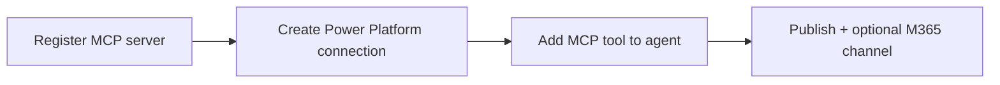

# Microsoft Copilot + OvalEdge MCP

This guide is for **Microsoft Copilot Studio** and **Microsoft 365 Copilot** (via a published Studio agent). It is **not** for **GitHub Copilot** in VS Code — see [SETUP_VSCODE_GITHUB_COPILOT.md](SETUP_VSCODE_GITHUB_COPILOT.md).

**Last reviewed against Microsoft Learn:** April–May 2026.

| Microsoft doc | What it covers |
| ------------- | -------------- |
| [Extend agent with MCP](https://learn.microsoft.com/en-us/microsoft-copilot-studio/agent-extend-action-mcp) | Overview, generative orchestration requirement |
| [Connect existing MCP server](https://learn.microsoft.com/en-us/microsoft-copilot-studio/mcp-add-existing-server-to-agent) | **New tool** → MCP onboarding wizard |
| [Add MCP tools to agent](https://learn.microsoft.com/en-us/microsoft-copilot-studio/mcp-add-components-to-agent) | **Add tool** → pick MCP connector from list |
| [Manage connections](https://learn.microsoft.com/en-us/microsoft-copilot-studio/authoring-connections) | Connection settings, status, parameters |
| [MCP troubleshooting](https://learn.microsoft.com/en-us/microsoft-copilot-studio/mcp-troubleshooting) | Known platform issues |

---

## What Microsoft Copilot can (and cannot) do

| Surface | How OvalEdge MCP is used |
| ------- | ------------------------ |
| **Copilot Studio** (build/test agents) | Register MCP server, create **connection**, add tools to agent |
| **Teams / Microsoft 365 Copilot** (end users) | Chat with a **published agent** that calls your MCP server — users do **not** paste the Lambda URL |
| **GitHub Copilot / VS Code** | Out of scope — separate guide |

MCP in Copilot Studio uses **Power Platform connectors** under the hood. Your OvalEdge server must be reachable over **HTTPS** with **Streamable HTTP** on **`POST /mcp`** (SSE-only MCP is deprecated; not supported after August 2025 per Microsoft).

---

## OvalEdge authentication

| Mode | Copilot Studio auth | MCP `AUTH_MODE` | When to use |
| ---- | ------------------- | ----------------- | ----------- |
| **API key** (recommended for Studio) | Header `X-OvalEdge-Credentials` = `token::secret` | `remote_credentials` | Simplest path; per-user or shared OvalEdge credentials |
| **OAuth 2.0 / Okta Connect** | Studio OAuth wizard → Okta authorize/token | `remote` | Same Okta Connect path as Cursor/Claude; requires Studio redirect URI on the Okta app |

### API key header (`remote_credentials`)

Copilot Studio exposes **one** API-key slot per MCP server (header **or** query). OvalEdge maps to a **single header**:

| Field | Value |
| ----- | ----- |
| **Header name** | `X-OvalEdge-Credentials` |
| **API key / secret value** | `YOUR_OVALEDGE_USER_TOKEN::YOUR_OVALEDGE_USER_SECRET` |

Rules:

- Literal **`::`** between token and secret  
- **No spaces** around `::`  
- OvalEdge user token and secret **do not** contain `::` (product guarantee)

The MCP server also accepts **`X-OvalEdge-Token`** + **`X-OvalEdge-Secret`** for Cursor, VS Code, etc. Use the **combined** header for Copilot Studio only.

Deploy with **`AUTH_MODE=remote_credentials`**. For Okta Connect instead, see [Remote OAuth](#remote-oauth-auth_moderremote) below.
---

## Prerequisites

1. **Deployed OvalEdge MCP** — `./scripts/deploy.sh` or `./scripts/deploy.sh --zip`; copy **`MCPEndpointUrl`** (ends with `/mcp`). See [infra/DEPLOY.md](../../infra/DEPLOY.md).
2. **OvalEdge user token + secret** per connection (or per end user — see [Per-user connections](#per-user-connections)).
3. **Generative orchestration** on the agent — **required** for MCP ([Microsoft Learn](https://learn.microsoft.com/en-us/microsoft-copilot-studio/agent-extend-action-mcp)). New agents default to generative mode; confirm under **Settings** → **Generative AI** → **Orchestration** → **Use generative AI orchestration** = **Yes**.
4. **Power Platform** — Copilot Studio (and Power Apps if you use a custom connector). MCP may be blocked by **data loss prevention (DLP)** policies on connectors.
5. **Public HTTPS** — Microsoft’s cloud calls your URL; private-only endpoints need a gateway or VPN pattern outside this guide.

---

## How Microsoft’s flow is structured (2026)

Microsoft documents MCP setup as a **lifecycle**, not a single form:



You may hit **different screens** depending on whether the MCP server is already registered in your environment:

| Situation | Typical UI path | Microsoft doc |
| --------- | ----------------- | --------------- |
| **First time** registering this URL | **Add a tool** → **New tool** → **Model Context Protocol** (wizard) | [Connect existing MCP server](https://learn.microsoft.com/en-us/microsoft-copilot-studio/mcp-add-existing-server-to-agent) |
| **Server already registered** (connector exists) | **Add a tool** → **Model Context Protocol** → pick **OvalEdge** from the list | [Add MCP components](https://learn.microsoft.com/en-us/microsoft-copilot-studio/mcp-add-components-to-agent) |
| **Enterprise / OpenAPI** pattern | **New tool** → **Custom connector** in Power Apps, then add connector to agent | Same doc, Option 2 |

OvalEdge works with the **native MCP wizard** (Path A below). Path B is for a second agent or re-adding after the connector exists.

---

## Path A — Register server with the MCP wizard (first time)

### A1. Open the wizard

1. [Copilot Studio](https://copilotstudio.microsoft.com/) → your **agent** → **Tools**.
2. **Add a tool** → **New tool** → **Model Context Protocol**.

### A2. Server details

| Field | Example / guidance |
| ----- | ------------------ |
| **Server name** | `OvalEdge` |
| **Server description** | Clear sentence for **generative orchestration**, e.g. “Search OvalEdge catalog, lineage, glossary, and tags for data governance questions.” |
| **Server URL** | Full **`MCPEndpointUrl`**, e.g. `https://abc123.execute-api.us-east-1.amazonaws.com/mcp` |

### A3. Authentication — API key

1. **Authentication:** **API key** (for `remote_credentials`). For Okta Connect use [Remote OAuth](#remote-oauth-auth_moderremote) instead.
2. **Type:** **Header** (not query).
3. **Header / parameter name:** `X-OvalEdge-Credentials`

### A4. Where to enter `token::secret` (UI varies)

Microsoft Learn describes the wizard as collecting the header **name**, then moving to an **Add tool** dialog for the connection ([source](https://learn.microsoft.com/en-us/microsoft-copilot-studio/mcp-add-existing-server-to-agent#configure-api-key-authentication)). Some tenants and partner guides show an **API key value** field **inside the same wizard** (e.g. Schema App’s Copilot steps, 2025).

Use whichever your UI shows:

| UI variant | Where to paste `YOUR_TOKEN::YOUR_SECRET` |
| ---------- | ---------------------------------------- |
| **A — Learn doc (common)** | Wizard: header name only → **Create** → **Add tool** dialog → **Create a new connection** → enter API key value → **Add to agent** |
| **B — Combined wizard fields** | Wizard: under **API key settings**, set header name `X-OvalEdge-Credentials` **and** paste value `token::secret` → **Create** → **Add to agent** / **Add and configure** |

If you complete the wizard but never enter the secret, the connector exists with status **Not connected** and MCP calls return **401**.

### A5. Confirm tool on the agent

1. On **Tools**, open the **OvalEdge** MCP entry.
2. Under **Tools** (MCP tool list), you should see OvalEdge tools such as `search_catalog_assets`, `catalog_asset_details`, etc.
3. Optionally turn off **Allow all** and disable tools you do not need ([Microsoft Learn](https://learn.microsoft.com/en-us/microsoft-copilot-studio/mcp-add-components-to-agent#customize-tool-selection-from-an-mcp-server-in-your-agent)).

---

## Path B — Add an existing MCP connector (already registered)

Use this when **Add a tool** → **Model Context Protocol** shows a **list of connectors** (e.g. **OE MCP**) instead of the full registration wizard.

### B1. “Add tool” dialog — Connection shows **Not connected**

You should see something like:

- Tool name: **OE MCP** (or the name you gave the server)
- Description: e.g. “Search OvalEdge catalog, lineage, glossary…”
- **Connection:** **Not connected** (with a dropdown on the right)
- **Add and configure** is **greyed out** until a connection is **Connected**

This is expected. Credentials are **not** entered on the MCP registration wizard alone — you must create a **connection** on this screen.

### B2. “Connect to OE MCP” — single required field (no label)

After **Create new connection**, Copilot Studio may open **Connect to OE MCP** with:

- Title: **Connect to OE MCP**
- One **required** text box (red asterisk `*`) — often **no label** (not spelled “API key”)
- **Create** disabled until the box is filled

Paste your OvalEdge credentials into that box as **one line**:

```text
YOUR_OVALEDGE_USER_TOKEN::YOUR_OVALEDGE_USER_SECRET
```

Example: `a1b2c3d4e5f6::x9y8z7w6v5u4` — double colon, no spaces.

That value is sent as the MCP **API key** for header **`X-OvalEdge-Credentials`** (configured when the server was registered). **Create** turns on once the field is non-empty.

### B3. Finish adding the tool

1. Select **Create** on the Connect dialog.
2. Back on **Add tool**, confirm **Connection** shows **Connected**.
3. Select **Add and configure** (now enabled).
4. On the MCP tool settings page, confirm OvalEdge tools appear (e.g. `search_catalog_assets`).

### B4. If the connection step does not appear

- Try **Settings** → **Connection settings** → find **OE MCP** → status link → **Add new connection** → paste `token::secret` → **Submit**.
- Return to **Tools** → **Add a tool** → **Model Context Protocol** → **OE MCP** again; pick the **Connected** connection from the dropdown.

To fix credentials later: **Settings** → **Connection settings** → **Connection parameters** ([Manage connections](https://learn.microsoft.com/en-us/microsoft-copilot-studio/authoring-connections)).

---

## Path C — Custom connector (optional, advanced)

Microsoft’s older walkthrough ([Tech Community, Aug 2025](https://techcommunity.microsoft.com/blog/microsoft365copilotblog/connecting-an-agent-in-copilot-studio-to-an-mcp-server/4448362)) and Azure samples use **Power Apps custom connectors** with OpenAPI and:

```yaml
x-ms-agentic-protocol: mcp-streamable-1.0
```

on `POST /mcp`. OvalEdge does **not** require this path if Path A works. Use Path C only if your tenant mandates connector certification or blocks the native MCP wizard.

---

---

## Remote OAuth (`AUTH_MODE=remote`)

Use when the MCP Lambda/host runs **Okta Connect** (same as Cursor/Claude): Studio completes OAuth against **Okta**, MCP validates the access token, and forwards `Authorization: Bearer` to OvalEdge.

**Prefer API key + `remote_credentials` for Copilot Studio** unless you need the same Okta identity as IDE clients. Studio’s OAuth UX is maker-configured (Client ID/Secret in the connection wizard), and redirect URIs are **per tool / environment**.

### Prerequisites

1. Deploy MCP with **`AUTH_MODE=remote`** — [Lambda ZIP Okta Connect](../../infra/DEPLOY.md#okta-connect-lambda-zip) or [README_REMOTE_MCP.md](../../README_REMOTE_MCP.md#lambda-zip-okta-connect-auth_moderremote).
2. OvalEdge `oauth2` + `api.introspection.*` aligned with the same Okta org.
3. Okta app: Authorization Code + PKCE; Client ID/Secret available for the Studio wizard **and** for Lambda `OAUTH_CLIENT_ID` / `OAUTH_CLIENT_SECRET`.

### Okta Sign-in redirect URIs

Copilot Studio **generates** a redirect URL when you create the MCP tool with OAuth 2.0. Copy it into Okta **Sign-in redirect URIs**. Typical patterns:

| URI | When |
|-----|------|
| `https://global.consent.azure-apim.net/redirect/<slug>` | MCP connector wizard (slug depends on tool name — changes if you rename the tool) |
| `https://token.botframework.com/.auth/web/redirect` | Bot Framework / Power Platform auth (common) |
| `https://europe.token.botframework.com/.auth/web/redirect` | Europe tenants |
| `https://copilotstudio.microsoft.com/auth/callback` | Copilot Studio web callback (when shown) |

If Okta/Entra returns **redirect_uri mismatch**, copy the **exact** URI from the error and add it to Okta.

Full IDE + Studio allowlist notes: [README_REMOTE_MCP.md — Okta redirect URIs (all clients)](../../README_REMOTE_MCP.md#okta-redirect-uris-all-clients).

### Studio wizard (OAuth 2.0)

1. **Add a tool** → **New tool** → **Model Context Protocol**.
2. **Server URL:** your **`MCPEndpointUrl`** (ends with `/mcp`).
3. **Authentication:** **OAuth 2.0** (Manual or Dynamic discovery if offered).
4. Point authorization/token at your Okta AS, for example:

| Field | Example |
|-------|---------|
| Authorization URL | `https://YOUR_OKTA_ORG.okta.com/oauth2/default/v1/authorize` |
| Token URL | `https://YOUR_OKTA_ORG.okta.com/oauth2/default/v1/token` |
| Client ID | Same as MCP `OAUTH_CLIENT_ID` |
| Client secret | Same as MCP `OAUTH_CLIENT_SECRET` (Studio connection secret — not `mcp.json`) |
| Scopes | `openid profile email` |

5. Copy the **callback / redirect URL** from Studio → add to Okta → finish connection.

Users who authorize must already exist in OvalEdge (email/username match) for tool calls to succeed after Connect.

### Microsoft 365 / Teams

Publish the agent as usual. End users complete the OAuth consent / connection prompt the first time tools run (similar to per-user API key connections).

---

## Publish to Microsoft 365 / Teams

1. **Test** in Copilot Studio (enable **Show activity map** to see MCP tool calls).
2. **Publish** the agent.
3. **Channels** — add **Microsoft Teams** and/or **Microsoft 365 Copilot** ([channel guidance](https://learn.microsoft.com/en-us/microsoft-copilot-studio/publication-add-bot-to-microsoft-teams)).
4. Share the agent with users/groups.

### End-user first connection (M365)

When an agent uses **per-user** API keys, end users may see a **Connection Manager** or sign-in prompt the first time they use the agent in Microsoft 365 Copilot ([Power Pages MCP client doc](https://learn.microsoft.com/en-us/power-pages/configure/mcp-connect-clients) describes a similar pattern). They must supply or confirm credentials, then **Retry** the chat.

---

## Per-user connections

Microsoft states that for API key MCP auth, **the user of the agent** may provide the API key ([Connect existing MCP server](https://learn.microsoft.com/en-us/microsoft-copilot-studio/mcp-add-existing-server-to-agent#configure-authentication-with-your-mcp-server)). Options:

| Model | When to use |
| ----- | ----------- |
| **Shared connection** (maker credentials) | Pilots, single service account — align with OvalEdge policy |
| **Per-user connection** | Production — each user’s `token::secret` maps to their OvalEdge RBAC |

Configure under connector tool **Details** → **Credentials to use** (maker vs end user) per [connector auth](https://learn.microsoft.com/en-us/microsoft-copilot-studio/advanced-connectors#use-connectors-with-maker-provided-credentials).

---

## Troubleshooting

| Symptom | Likely cause | Action |
| ------- | ------------- | ------ |
| **Connect to OE MCP** — one blank required box, no “API key” label | This **is** the credential field | Paste `token::secret` → **Create** |
| No field for API key **value** in wizard | Variant A UI | Enter value on **Create new connection** after **Create** |
| **Not connected** on Add tool; **Add and configure** disabled | No connection yet | Use **Connection** dropdown → **Create new connection** → paste `token::secret` |
| **Not connected** after that | Missing or wrong connection | Connection settings → set `token::secret` for `X-OvalEdge-Credentials` |
| **401** from MCP | Bad or expired OvalEdge credentials | Regenerate token/secret; update connection |
| No MCP tools listed | Connection failed or server unreachable | Test with curl below; check URL ends with `/mcp` |
| Agent ignores MCP | Classic orchestration | Enable **generative orchestration** |
| Connector blocked | DLP | Power Platform admin — allow MCP / custom connector |
| Tool schema errors | Platform limitation | See [MCP troubleshooting](https://learn.microsoft.com/en-us/microsoft-copilot-studio/mcp-troubleshooting) |

Platform issues (SSE URI format, schema truncation, etc.) are on Microsoft’s side — see their troubleshooting article.

---

## Verify OvalEdge MCP (curl)

```bash
curl -sS "https://YOUR_PUBLIC_MCP_HOST/health"

curl -sS "https://YOUR_PUBLIC_MCP_HOST/mcp" \
  -H "X-OvalEdge-Credentials: YOUR_TOKEN::YOUR_SECRET" \
  -H "Content-Type: application/json" \
  -H "Accept: application/json, text/event-stream" \
  --data-binary '{"jsonrpc":"2.0","id":1,"method":"initialize","params":{"protocolVersion":"2024-11-05","capabilities":{},"clientInfo":{"name":"curl","version":"1"}}}'
```

Expect **200** on `/health`. `/mcp` should return a valid MCP response when credentials are correct.

---

## Related docs

- [README_REMOTE_MCP.md](../../README_REMOTE_MCP.md) — deploy, Okta Connect, `MCP_HTTP_STATELESS`, security  
- [infra/DEPLOY.md — Okta Connect Lambda ZIP](../../infra/DEPLOY.md#okta-connect-lambda-zip)  
- [.env.example](../../.env.example) — `remote` / `remote_credentials`  
- [SETUP_VSCODE_GITHUB_COPILOT.md](SETUP_VSCODE_GITHUB_COPILOT.md) — GitHub Copilot only  
