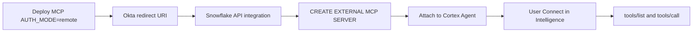

# Snowflake Cortex + OvalEdge MCP

This guide wires **OvalEdge MCP** as an **external MCP connector** for [Snowflake Cortex Agents](https://docs.snowflake.com/en/user-guide/snowflake-cortex/cortex-agents) and Snowflake Intelligence.

It is **not**:

- Snowflake’s **managed** MCP server (`CREATE MCP SERVER` with Cortex Search / Analyst / SQL tools)
- OvalEdge **RDAM** native Snowflake grants (`access_explorer` with `operation=source_system_access`)
- Local stdio (`oe-mcp-local`) or `AUTH_MODE=remote_credentials` (Cortex OAuth only; it will not send `X-OvalEdge-*` headers)

**Last reviewed:** September 2026. Snowflake docs: [MCP connectors](https://docs.snowflake.com/en/user-guide/snowflake-cortex/cortex-agents-mcp-connectors).

---

## What Cortex can (and cannot) do

| Surface | How OvalEdge MCP is used |
| ------- | ------------------------ |
| **Cortex Agent** | Discovers tools with `tools/list`, invokes them with `tools/call` |
| **Snowflake Intelligence** | Users **Connect** the connector (browser OAuth to your IdP), then chat with an agent that has the MCP server attached |
| **Agent:run API** | Same connector; complete OAuth with `SYSTEM$START_USER_OAUTH_FLOW` / `SYSTEM$FINISH_OAUTH_FLOW` |

Snowflake documents these limits for **external** MCP servers:

| Supported | Not supported |
| --------- | ------------- |
| Tools (`tools/list`, `tools/call`) | Resources, prompts, sampling, notifications, MCP elicitation |
| OAuth 2.0 only | API keys / `X-OvalEdge-Credentials` |
| Streamable HTTP `POST` to `/mcp` | stdio |

Workflow prompts (`document_asset_descriptions`, `create_governance_tag`, …) are **not** invoked. Governed writes still need `write_confirmed_by_user=true` after an explicit user approval in the chat; Cortex has no MCP elicitation for the confirm gate.

---

## Authentication

| Mode | Cortex | MCP `AUTH_MODE` | When to use |
| ---- | ------ | ----------------- | ----------- |
| **Okta / OIDC Connect** | Snowflake API integration + user OAuth | `remote` | **Required** for Cortex |
| API key headers | Not used | `remote_credentials` | Do **not** use for Cortex |
| Local token+secret | Not used | `local` | IDE stdio only |

Flow:

1. Cortex (or Snowflake Intelligence) obtains an access token from **your IdP** (Okta).
2. It calls `POST https://YOUR_PUBLIC_MCP_BASE_URL/mcp` with `Authorization: Bearer <access_token>`.
3. This server validates the token and forwards the same Bearer token to OvalEdge (`OVALEDGE_REMOTE_FORWARD_IDP_TOKEN=true`).
4. OvalEdge maps the principal (usually **email**) to an existing OvalEdge user and RBAC.

---

## Prerequisites

1. **Public HTTPS MCP** — stack output **`MCPEndpointUrl`** ending in `/mcp`. Hostnames must use **hyphens**, not underscores. Snowflake must be able to reach this URL (allow WAF / SG if you locked the API down).
2. **`AUTH_MODE=remote`** — [Lambda ZIP Okta Connect](../../infra/DEPLOY.md#okta-connect-lambda-zip) or [README_REMOTE_MCP.md](../../README_REMOTE_MCP.md#auth_moderremote-okta--oidc-connect).
3. **`MCP_JSON_RESPONSE=true`** (default) — Cortex sends `Accept: application/json` **only**. FastMCP SSE mode then returns `-32600 Not Acceptable`. JSON mode returns JSON-RPC as `application/json`. See [README_REMOTE_MCP.md](../../README_REMOTE_MCP.md).
4. **Okta OIDC app** — Authorization Code + PKCE; `OAUTH_CLIENT_ID` / `OAUTH_CLIENT_SECRET` on the MCP host (confidential Web app). Prefer a dedicated MCP app. Enable the **Refresh Token** grant. Requested scopes **must** be `openid`, `profile`, `email`, **and** `offline_access` (Snowflake keeps the connector Connected with a refresh token).
5. **Sign-in redirect URI** on that Okta app:

   ```text
   https://identity.snowflake.com/oauth2/callback
   ```

   PrivateLink accounts use a different callback from `SYSTEM$ALLOWLIST_PRIVATELINK` (entry starting `app..privatelink.snowflakecomputing`) plus `/oauth/complete-secret`. See Snowflake’s MCP connector docs.
6. **OvalEdge `oauth2` profile** — `api.introspection.uri` matches `{OAUTH_ISSUER}/v1/introspect`; Okta email/username already exists in OvalEdge.
7. Snowflake privileges: `CREATE EXTERNAL MCP SERVER` on the schema; later `USAGE` on the external MCP server **and** the API integration.

---

## How the pieces fit



---

## 1. Deploy OvalEdge MCP

Deploy with Okta Connect (same as Cursor/Claude). Copy **`MCPEndpointUrl`** and **`MCPPublicBaseUrl`**.

Confirm:

```bash
curl -sS "https://YOUR_PUBLIC_MCP_BASE_URL/health"
# expect: "auth_mode":"remote"  and  "mcp_lifespan_ready":true
```

Smoke-test MCP the way Cortex does (`Accept: application/json` only — no `text/event-stream`):

```bash
curl -sS -X POST "https://YOUR_PUBLIC_MCP_BASE_URL/mcp" \
  -H "Authorization: Bearer $OKTA_ACCESS_TOKEN" \
  -H "Content-Type: application/json" \
  -H "Accept: application/json" \
  -d '{"jsonrpc":"2.0","id":1,"method":"initialize","params":{"protocolVersion":"2025-03-26","capabilities":{},"clientInfo":{"name":"curl","version":"1.0"}}}'
```

Expect **`Content-Type: application/json`** and a JSON-RPC result, not `text/event-stream`. If you get `-32600 Not Acceptable`, the running artifact still has SSE mode — redeploy a build with `MCP_JSON_RESPONSE=true`.

`YOUR_PUBLIC_MCP_BASE_URL` is the MCP host (keep `https://` and `/mcp`). It is **not** `OVALEDGE_BASE_URL`.

---

## 2. Register Snowflake’s callback on Okta

Okta Admin → the MCP OIDC app → **General** → **Sign-in redirect URIs** → add `https://identity.snowflake.com/oauth2/callback`.

Missing this URI fails at consent (`redirect_uri` must be a Login redirect URI). Full client allowlist: [README_REMOTE_MCP.md — Okta redirect URIs](../../README_REMOTE_MCP.md#okta-redirect-uris-all-clients).

---

## 3. Create the Snowflake connector (account admin)

Snowflake only supports **OAuth** for MCP connectors. Create an API integration, then an external MCP server.

**Option A — Dynamic Client Registration (fits this server)**

This MCP implements `POST /register` and RFC 9728 at `/.well-known/oauth-protected-resource/mcp`. Snowflake discovers the IdP and registers against the pre-configured `OAUTH_CLIENT_ID` (the server does not mint a new Okta app).

Set MCP `OAUTH_SCOPES` so discovery/registration advertises **`openid profile email offline_access`**. Omitting `offline_access` prevents Snowflake from issuing a refresh token.

```sql
CREATE API INTEGRATION ovaledge_mcp_api_integration
  API_PROVIDER = external_mcp
  API_ALLOWED_PREFIXES = ('https://YOUR_PUBLIC_MCP_HOST')
  API_USER_AUTHENTICATION = (
    TYPE = OAUTH_DYNAMIC_CLIENT
    OAUTH_RESOURCE_URL = 'https://YOUR_PUBLIC_MCP_HOST/mcp'
  )
  ENABLED = TRUE;

CREATE EXTERNAL MCP SERVER ovaledge_mcp
  WITH DISPLAY_NAME = 'OvalEdge MCP'
  URL = 'https://YOUR_PUBLIC_MCP_HOST/mcp'
  API_INTEGRATION = ovaledge_mcp_api_integration;
```

Replace `YOUR_PUBLIC_MCP_HOST` with the host from **`MCPPublicBaseUrl`** (no trailing slash on the prefix; URL includes `/mcp`).

**Option B — Static OAuth 2.0**

Point **authorize** and **token** at **Okta**, not at this MCP host. MCP only proxies discovery; it is not the token issuer.

When `OAUTH_CLIENT_SECRET` is set on the MCP server, token exchange uses **`client_secret_post`** (not Snowflake’s default `CLIENT_SECRET_BASIC`).

`OAUTH_ALLOWED_SCOPES` **must** include `openid`, `profile`, `email`, **and** `offline_access`. Do not stop at the first three — Cortex needs `offline_access` for refresh tokens (`OAUTH_REFRESH_TOKEN_VALIDITY` has no effect without it).

```sql
CREATE API INTEGRATION ovaledge_mcp_api_integration
  API_PROVIDER = external_mcp
  API_ALLOWED_PREFIXES = ('https://YOUR_PUBLIC_MCP_HOST')
  API_USER_AUTHENTICATION = (
    TYPE = OAUTH2
    OAUTH_CLIENT_ID = '<same as OAUTH_CLIENT_ID>'
    OAUTH_CLIENT_SECRET = '<same as OAUTH_CLIENT_SECRET>'
    OAUTH_AUTHORIZATION_ENDPOINT = 'https://YOUR_OKTA_ORG.okta.com/oauth2/default/v1/authorize'
    OAUTH_TOKEN_ENDPOINT = 'https://YOUR_OKTA_ORG.okta.com/oauth2/default/v1/token'
    OAUTH_CLIENT_AUTH_METHOD = CLIENT_SECRET_POST
    OAUTH_ALLOWED_SCOPES = ('openid', 'profile', 'email', 'offline_access')
    OAUTH_REFRESH_TOKEN_VALIDITY = 86400
  )
  ENABLED = TRUE;
```

Then `CREATE EXTERNAL MCP SERVER` as in option A.

Grant usage (required on **both** objects):

```sql
GRANT USAGE ON EXTERNAL MCP SERVER ovaledge_mcp TO ROLE <role_name>;
GRANT USAGE ON INTEGRATION ovaledge_mcp_api_integration TO ROLE <role_name>;
```

---

## 4. Attach the connector to a Cortex Agent

Snowsight: **AI & ML → Agents →** agent → **MCP Connectors → Add**.

SQL (include the rest of the agent spec you already use):

```sql
ALTER AGENT my_cortex_agent
  ADD MCP_SERVER = 'db.schema.ovaledge_mcp';
```

Or set `mcp_servers` on the agent specification / REST `PUT` as in [Snowflake MCP connectors](https://docs.snowflake.com/en/user-guide/snowflake-cortex/cortex-agents-mcp-connectors).

---

## 5. Users Connect, then ask

In **Snowflake Intelligence**:

1. Open the sources panel → **Connectors** → **Connect** next to OvalEdge MCP.
2. Complete Okta consent. The connector shows **Connected**.
3. Ask catalog questions (the agent will call `asset_explorer` / `asset_details` as needed).

Connectors that are not **Connected** are omitted from orchestration. Expired tokens prompt re-auth.

**Agent:run API** (same session):

```sql
SELECT SYSTEM$START_USER_OAUTH_FLOW('OVALEDGE_MCP_API_INTEGRATION');
-- open the returned URL, then:
-- SYSTEM$FINISH_OAUTH_FLOW('<query_string_from_redirect>')
```

Use the **API integration name**, not the MCP server name.

---

## Transport: JSON, not SSE

Cortex’s connector client sends:

```http
Accept: application/json
```

It does **not** send `text/event-stream`. This server’s HTTP entrypoint therefore runs FastMCP with **`json_response=True`** (`MCP_JSON_RESPONSE`, default **true**) so that:

- The Accept check does **not** require `text/event-stream`.
- `tools/list` / `tools/call` return a single JSON-RPC body (`Content-Type: application/json`).

That is separate from Snowflake-managed MCP, which (as of August 2026) streams `tools/call` as SSE to **clients that call Snowflake**. That change does **not** apply to this external connector.

Set `MCP_JSON_RESPONSE=false` only if a **different** client must receive SSE on POST. Cortex will break again.

---

## Agent routing (same as other clients)

Treat `server/docs/mcp_workflows.md` as canonical. Short version:

| Intent | Tool |
| ------ | ---- |
| Org knowledge / OvalEdge how-to | `knowledge_search` |
| Find catalog assets | `asset_explorer` → `asset_details` |
| Native Snowflake/Redshift/Tableau grants | `access_explorer` `operation=source_system_access` |
| User-facing links | `navLink` / `redirectUrl` — never `ovaledge://` |

---

## Troubleshooting

| Symptom | Likely cause | What to do |
| ------- | ------------ | ---------- |
| `-32600` `Not Acceptable: Client must accept both application/json and text/event-stream` | Running Lambda still in SSE mode | Redeploy with `MCP_JSON_RESPONSE=true`; re-run the JSON-only `curl` above |
| `redirect_uri` must be a Login redirect URI | Snowflake callback missing on Okta | Add `https://identity.snowflake.com/oauth2/callback` |
| Connect OK, tools 401 *Full authentication is required* | OvalEdge ignored Okta Bearer | Enable `oauth2` on the pod; align introspect URI/client with the token issuer |
| Connect OK, tools 401 *user … doesnot exist* | Okta email not in OvalEdge | Create/link the user |
| Connector never **Connected** | User skipped Intelligence Connect | Connect in sources; Agent:run needs `SYSTEM$START_USER_OAUTH_FLOW` |
| Connect works, then expires / re-auth loops | Scopes missing `offline_access` (no refresh token) | Add `offline_access` to Okta, `OAUTH_SCOPES`, and `OAUTH_ALLOWED_SCOPES` with `openid profile email`; enable Refresh Token on the Okta app |
| 403 from API Gateway / WAF | Snowflake egress not allowlisted | Open WAF CIDRs or disable WAF for this API ([DEPLOY.md](../../infra/DEPLOY.md)) |
| Tools exist in Cursor but Cortex never calls them | Agent spec missing MCP server, or connector disabled | `SHOW EXTERNAL MCP SERVERS`; API integration `ENABLED = TRUE`; attach to the agent |

More OAuth/Lambda patterns: [infra/TROUBLESHOOTING_REMOTE.md](../../infra/TROUBLESHOOTING_REMOTE.md).

---

## Related

- [README_REMOTE_MCP.md](../../README_REMOTE_MCP.md) — `AUTH_MODE=remote`, Okta, `MCP_JSON_RESPONSE`
- [infra/DEPLOY.md](../../infra/DEPLOY.md#okta-connect-lambda-zip) — Lambda ZIP Okta Connect
- [docs/client-setup/README.md](README.md) — all clients
- [SETUP_CURSOR.md](SETUP_CURSOR.md#remote-oauth-auth_moderremote) — same Okta app, different redirect URI
- [Snowflake MCP connectors](https://docs.snowflake.com/en/user-guide/snowflake-cortex/cortex-agents-mcp-connectors)
